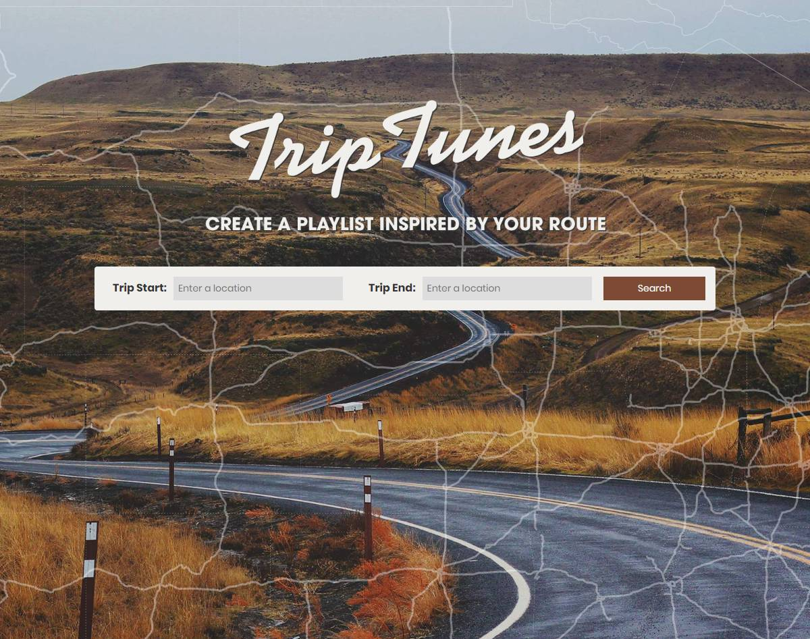
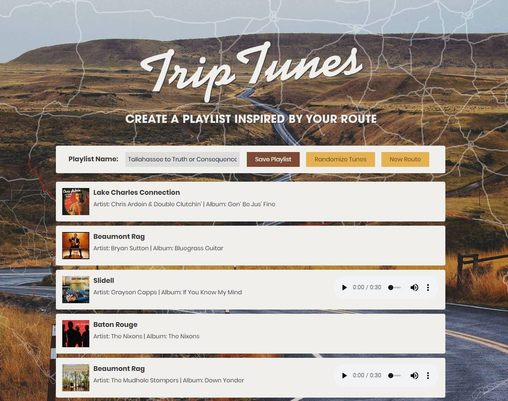

# Trip Tunes
Create a playlist based on your route!

https://davelarimore.github.io/trip-tunes/

### Summary
Enter the start end end locations for your road trip and this app will create a Spotify song playlist based on the cities and towns along that route. A randomizer feature provides for a variety of song results, even along the same route. 

### Technology:
HTML/CSS/JavaScript/jQuery

### APIs used:
* Google Maps Javascript API
* MapQuest Geocoding API
* Spotify API

### Screenshots

